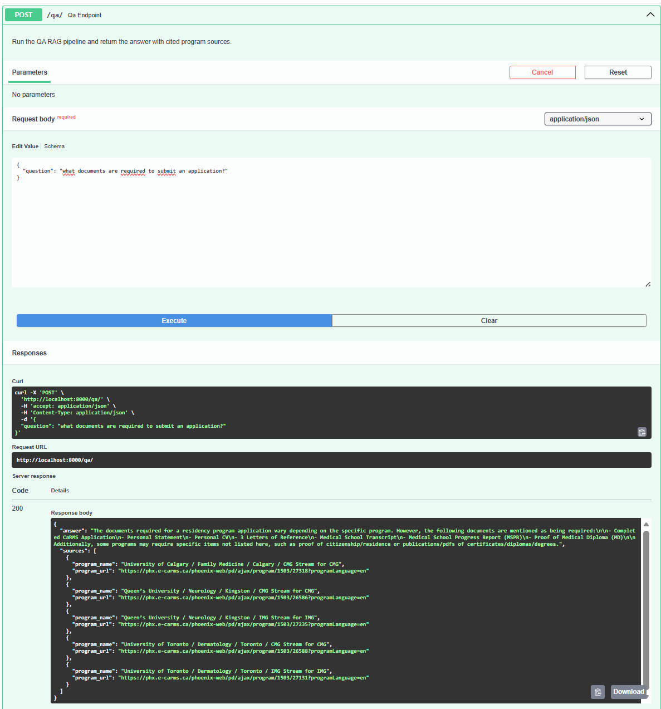

# CaRMS Data Platform

A containerized data platform built on public CaRMS residency program data. Demonstrates end-to-end data engineering: automated ETL pipelines, a normalized PostgreSQL database, a REST API, a RAG Q&A system, and an analytics dashboard — all orchestrated with Docker Compose.

---

## Quick Start

Defaults to **Ollama** — fully offline, local models, no API key required.

```bash
git clone https://github.com/ElhadjDt/carms-data-platform.git
cd carms-data-platform/carms-data-platform-demo

cp .env.example .env

docker compose build
docker compose up -d db
docker compose run --rm init-db
docker compose run --rm etl

docker compose --profile ollama up -d ollama
docker exec carms_ollama ollama pull llama3.2:1b
docker exec carms_ollama ollama pull all-minilm:l6

# Instant: use the prebuilt FAISS index shipped in the repo instead of
# re-embedding ~9k program descriptions locally (see "Speed" note below).
mkdir -p ../data/embeddings/faiss_index
cp -r prebuilt_faiss/ollama/. ../data/embeddings/faiss_index/

docker compose up -d api dashboard
```

Prefer OpenAI? See [OpenAI mode](#openai-mode) — set an API key instead of running Ollama.

| Service | URL |
|---------|-----|
| API (Swagger UI) | http://localhost:8000/docs |
| Streamlit dashboard | http://localhost:8501 |
| Dagster (optional) | http://localhost:3000 |

**Done testing?** `docker compose --profile ollama down -v --rmi all --remove-orphans` (or `make clean`) tears down every container, volume, and image this project created — see [Cleanup](#cleanup).

---

## Tech Stack

| Component | Technology |
|-----------|-----------|
| Database | PostgreSQL 16 |
| ORM | SQLModel / SQLAlchemy |
| API | FastAPI |
| Dashboard | Streamlit + Plotly |
| ETL orchestration | Dagster |
| RAG pipeline | LangChain + FAISS + Ollama (default) or OpenAI |
| Infrastructure | Docker & Docker Compose |

---

## Table of Contents

1. [Setup](#setup)
2. [Database Design](#database-design)
3. [RAG Q&A System](#rag-qa-system)
4. [API Reference](#api-reference)
5. [Environment Variables](#environment-variables)
6. [Cleanup](#cleanup)
7. [Troubleshooting](#troubleshooting)

---

## Setup

### Prerequisites

- Docker and Docker Compose
- [Ollama](https://ollama.com) (default, runs as a Docker service — no API key needed) **or** an OpenAI API key (see [OpenAI mode](#openai-mode))
- RAM available to Docker: ~5-6 GB for Ollama mode (default), ~3.1 GB for OpenAI mode (see [memory requirements](#troubleshooting))

### Step-by-step

**1. Configure environment**

```bash
cp .env.example .env
# Defaults to Ollama (local, no API key). To use OpenAI instead, set
# OPENAI_API_KEY and switch LLM_PROVIDER/EMBEDDING_PROVIDER to 'openai'
# — see OpenAI mode below.
```

**2. Build the image**

```bash
docker compose build
```

**3. Initialize the database**

```bash
docker compose up -d db
docker compose run --rm init-db
```

**4. Run the ETL pipeline**

Extracts ZIP archives, loads disciplines and programs, and loads program descriptions into the database.

```bash
docker compose run --rm etl
```

**5. Start Ollama and get the FAISS index**

Pull the two local models, then use the prebuilt FAISS index shipped in the repo — instant, no local embedding needed for the common case. The `ollama` Compose service is pinned to `ollama/ollama:0.31.2`.

```bash
docker compose --profile ollama up -d ollama
docker exec carms_ollama ollama pull llama3.2:1b
docker exec carms_ollama ollama pull all-minilm:l6

mkdir -p ../data/embeddings/faiss_index
cp -r prebuilt_faiss/ollama/. ../data/embeddings/faiss_index/
#   ...or, if you've changed the data: docker compose run --rm embeddings
```

> **Speed:** The prebuilt index above covers the full CaRMS dataset shipped in this repo, so setup only needs seconds to copy it into place. If you edit `data/raw/` and need to rebuild: `docker compose run --rm embeddings` chunks program descriptions at 2000 chars (200 overlap), which keeps chunk count — and CPU-only embedding time — proportional to the actual dataset instead of over-fragmenting it. The `ollama` service also sets `OLLAMA_NUM_PARALLEL=4` so multiple chunks embed concurrently instead of one at a time; raise it (e.g. to your CPU core count) in `docker-compose.yml` for a further speedup on higher-core machines, or lower it if you're memory-constrained. Expect single-digit minutes on a modern multi-core machine for a full rebuild.

**6. Start the application**

```bash
docker compose up -d api dashboard

# Optional: Dagster orchestration UI
docker compose up -d dagster
```

### OpenAI mode

Use OpenAI's hosted models instead of local Ollama — skip step 5 above and do this instead:

```bash
# .env: set OPENAI_API_KEY, LLM_PROVIDER=openai, EMBEDDING_PROVIDER=openai

docker compose run --rm embeddings   # builds the OpenAI-dimension (1536) FAISS index
docker compose up -d api dashboard
```

> **Note:** The prebuilt index in `prebuilt_faiss/ollama/` is Ollama-only (`all-minilm:l6`, 384-dim) — OpenAI mode always needs its own `embeddings` run, since the vector dimensions are incompatible (1536 vs 384).

### Service management

```bash
# Check running containers
docker compose ps

# Stream logs for a service
docker compose logs -f api

# Stop all services
docker compose down
```

See [Cleanup](#cleanup) to fully tear down containers, volumes, and images.

---

## Database Design

### Problem

The raw CaRMS data ships as two Excel files: `1503_discipline.xlsx` and `1503_program_master.xlsx`. The program master file mixes discipline, school, stream, site, and program attributes into a single flat table — storing everything together violates normalization rules and creates update, insertion, and deletion anomalies.

### Normalized Schema (3NF)

The program master file is decomposed into four relational tables, plus a fifth table for program descriptions loaded from CSV:

**Table: discipline**

| Column | Type |
|--------|------|
| discipline_id | PK |
| discipline_name | Text |

**Table: school**

| Column | Type |
|--------|------|
| school_id | PK |
| school_name | Text |

**Table: stream**

| Column | Type |
|--------|------|
| program_stream_id | PK |
| program_stream | Text |
| program_stream_name | Text |

**Table: site**

| Column | Type |
|--------|------|
| site_id | PK (auto-increment) |
| site_name | Text |

**Table: program**

| Column | Type |
|--------|------|
| program_id | PK (auto-increment) |
| discipline_id | FK → discipline |
| school_id | FK → school |
| program_stream_id | FK → stream |
| site_id | FK → site |
| program_name | Text |
| program_url | Text |

**Table: program_document**

| Column | Type |
|--------|------|
| id | PK (auto-increment) |
| program_id | FK → program |
| section_name | Text |
| content | Text |
| source | Text |


### Population

The ETL pipeline loads both Excel files row-by-row using SQLModel, resolving dimension records (school, stream, site) with get-or-create logic before inserting each program. Program descriptions are loaded from `1503_program_descriptions_x_section.csv` and normalized wide-to-long into `program_document`.

---

## RAG Q&A System

The platform includes a Retrieval-Augmented Generation pipeline that answers natural language questions about residency programs.

**Pipeline:**

1. Program descriptions from `program_document` are chunked (2000 chars, 200-char overlap)
2. Each chunk is embedded (with `program_name`/`program_url` attached as metadata) and stored in a FAISS index
3. At query time, the top-5 most relevant chunks are retrieved
4. An LLM generates an answer grounded in the retrieved context, and the API returns `sources` linked directly to that answer — the real CaRMS program page URLs the answer was actually drawn from, not just prose

**Providers** (set via env vars — no code changes needed):

| `EMBEDDING_PROVIDER` | Model | Dim | `LLM_PROVIDER` | Model |
|---|---|---|---|---|
| `ollama` (default) | `all-minilm:l6` | 384 | `ollama` (default) | `llama3.2:1b` |
| `openai` | `text-embedding-3-small` | 1536 | `openai` | `gpt-4o-mini` |

The QA system is exposed as a REST endpoint (`POST /qa`) and through the Streamlit dashboard.


---

## API Reference

The FastAPI backend exposes 14 endpoints across two categories.

**Relational data** — `GET /disciplines`, `/programs`, `/schools`, `/sites`, `/streams` (with individual record lookup by ID), and `GET /health`


**Q&A** — `POST /qa` — accepts a question string (1–500 characters), returns an LLM answer grounded in program descriptions plus a `sources` list of the distinct `{program_name, program_url}` pages the answer was drawn from — real links back into the CaRMS dataset, not just prose



Full endpoint details with example request and response values: [docs/api-endpoints.md](docs/api-endpoints.md)

Interactive documentation available at **http://localhost:8000/docs** once the API is running.

---

## Environment Variables

| Variable | Required | Default | Description |
|----------|----------|---------|-------------|
| `OPENAI_API_KEY` | When `*_PROVIDER=openai` | — | OpenAI API key |
| `POSTGRES_USER` | No | `carms` | PostgreSQL username |
| `POSTGRES_PASSWORD` | No | `carms` | PostgreSQL password |
| `POSTGRES_DB` | No | `carms_db` | PostgreSQL database name |
| `DATABASE_URL` | No | `postgresql+psycopg2://carms:carms@db:5432/carms_db` | Full connection string |
| `LLM_PROVIDER` | No | `ollama` | LLM backend: `ollama` or `openai` |
| `EMBEDDING_PROVIDER` | No | `ollama` | Embedding backend: `ollama` or `openai` |
| `OLLAMA_HOST` | No | `http://ollama:11434` | Ollama server URL |
| `OLLAMA_LLM_MODEL` | No | `llama3.2:1b` | Ollama model for generation |
| `OLLAMA_EMBEDDING_MODEL` | No | `all-minilm:l6` | Ollama model for embeddings |
| `DATA_DIR` | No | `/data` (inside container) | Path to the data directory |
| `FAISS_PATH` | No | `{DATA_DIR}/embeddings/faiss_index` | Path to the FAISS index |
| `CORS_ORIGINS` | No | `http://localhost:8501` | Comma-separated allowed origins for the API |

All variables can be set in `.env` (gitignored). Docker Compose injects them into each container.

---

## Cleanup

Tear down everything this project created — containers, networks, volumes (Postgres data + pulled Ollama models), and every image (locally built and pulled, including `ollama/ollama`):

```bash
docker compose --profile ollama down -v --rmi all --remove-orphans
```

Or, equivalently:

```bash
make clean
```

To stop services without deleting anything (keep data/models for next time), use `docker compose down` instead — see [Service management](#service-management).

---

## Troubleshooting

**Database won't start**
```bash
docker compose logs db
# Common cause: port 5432 already in use locally
# Fix: stop local PostgreSQL, or change the port mapping in docker-compose.yml
```

**ETL fails with "Missing required columns"**

The raw data files must be present at `data/raw/` before running the ETL. Verify:
```bash
ls data/raw/
# Should include: 1503_discipline.xlsx, 1503_program_master.xlsx, *.zip
```

**Embeddings fail — OpenAI error**

Check that `OPENAI_API_KEY` is set in `.env` and has sufficient quota. The embeddings step calls the OpenAI API and will fail with `AuthenticationError` if the key is missing or invalid.

**Out of memory during setup**

Ollama mode (default) requires ~5–6 GB RAM at peak with both local models loaded (`llama3.2:1b` + `all-minilm:l6`). OpenAI mode is lighter — ~3.1 GB peak, since generation/embedding happen in the cloud instead of locally. If Docker OOMs, increase memory in Docker Desktop settings or run setup steps one at a time with pauses between.

**FAISS index not found when starting API**

The API needs `data/embeddings/faiss_index/` to exist before it starts. In Ollama mode, copy the prebuilt index (`cp -r prebuilt_faiss/ollama/. ../data/embeddings/faiss_index/`) or run `docker compose run --rm embeddings` to build it yourself; in OpenAI mode you must run `embeddings`. Confirm the directory exists before `docker compose up -d api`.

---

## AWS Deployment

A production deployment architecture mapping this platform to managed AWS services (RDS, ECS Fargate, S3, Secrets Manager) is documented in [docs/aws-architecture.md](docs/aws-architecture.md).
